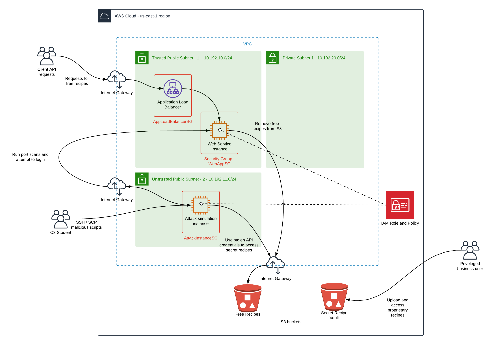
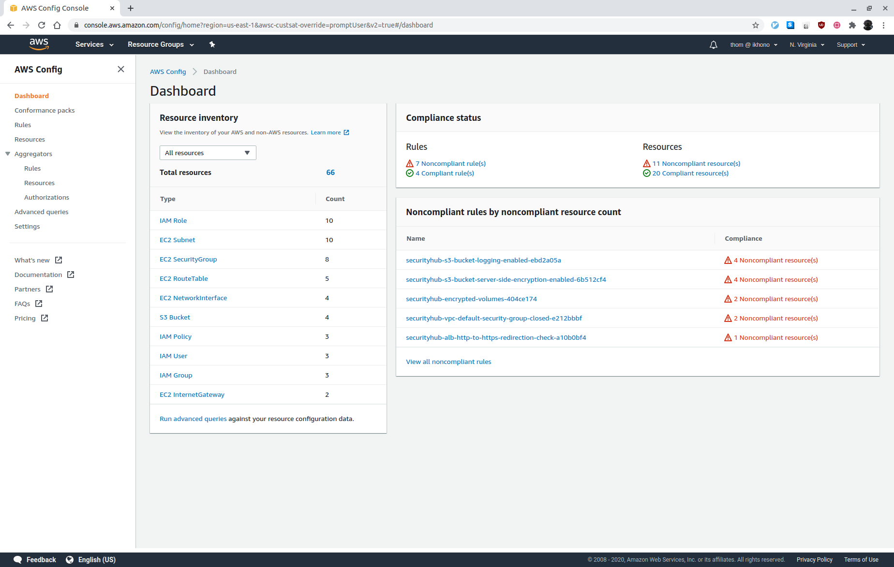
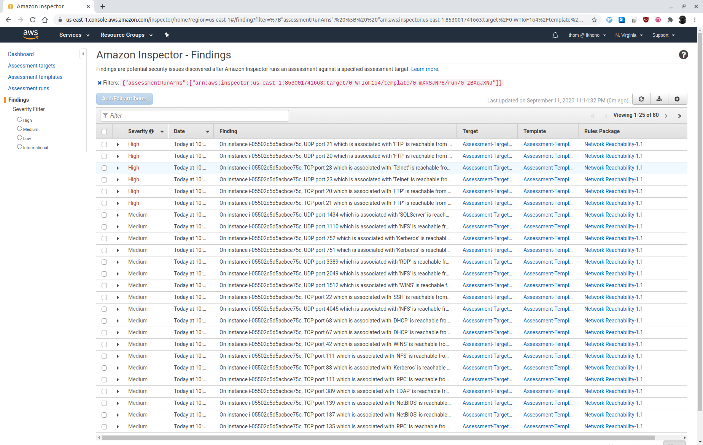
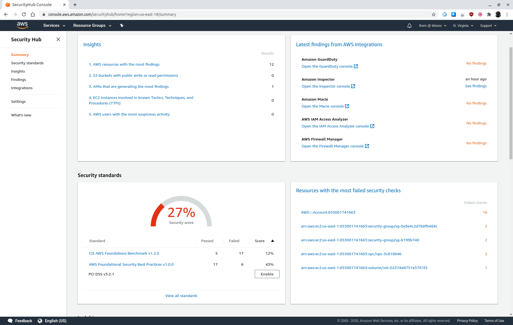

# Udacity AWS Cloud Architect Program - Project 3: Cloud Security - Protecting Resources and Data in the Cloud

## Exercise 1 - Deploy Project Environment

### Task 1: Review Architecture Diagram

 _Starting architecture diagram_

#### Expected user flow:
- Clients will invoke a public-facing web service to pull free recipes.
- The web service is hosted by an HTTP load balancer listening on port 80.
- The web service is forwarding requests to the web application instance which
  listens on port 5000.
- The web application instance will, in turn, use the public-facing AWS API to
  pull recipe files from the S3 bucket hosting free recipes. An IAM role and
  policy will provide the web app instance permissions required to access
  objects in the S3 bucket.
- Another S3 bucket is used as a vault to store secret recipes; there are
  privileged users who would need access to this bucket. The web application
  server does not need access to this bucket.

#### Attack flow:
- Scripts simulating an attack will be run from a separate instance which is in
  an un-trusted subnet.
- The scripts will attempt to break into the web application instance using the
  public IP and attempt to access data in the secret recipe S3 bucket.

### Task 2: Review CloudFormation Template

#### VPC Stack for the underlying network:
- A VPC with 2 public subnets, one private subnet, and internet gateways etc for
  internet access
- See [c3-vpc.yml](cfn/c3-vpc.yml)

#### S3 bucket stack:
- 2 S3 buckets that will contain data objects for the application
- See [c3-s3.yml](cfn/c3-s3.yml)

#### Application stack:
- An EC2 instance that will act as an external attacker from which we will test
  the ability of our environment to handle threats
- An EC2 instance that will be running a simple web service
- Application LoadBalancer
- Security groups
- IAM role
- See [c3-app.yml](cfn/c3-app.yml)

### Task 3: Deployment of Initial Infrastructure

The objective is to deploy the CloudFormation stacks that will create the above
environment.
 
The AMIs specified in the CloudFormation template exist in the us-east-1 (N.
Virginia) region. It is necessary to set this as default region when deploying
resources for this project.

#### 1. Deploy the infrastructure

##### Deploy the S3 buckets
```
aws cloudformation create-stack --region us-east-1 --stack-name c3-s3 --template-body file://c3-s3.yml
```
 
Expected example output:
```
{
    "StackId": "arn:aws:cloudformation:us-east-1:853001741663:stack/c3-s3/b60f3770-f46b-11ea-bc10-1221171ce649"
}
```

##### Deploy the VPC and Subnets
```
aws cloudformation create-stack --region us-east-1 --stack-name c3-vpc --template-body file://c3-vpc.yml
```
 
Expected example output:
```
{
    "StackId": "arn:aws:cloudformation:us-east-1:853001741663:stack/c3-vpc/8ce78590-f46c-11ea-9b06-1214c28caebf"
}
```
 
##### Deploy the Application Stack 
Specify a pre-existing key-pair name:

```
aws cloudformation create-stack --region us-east-1 --stack-name c3-app --template-body file://c3-app.yml --parameters ParameterKey=KeyPair,ParameterValue=<add key pair name> --capabilities CAPABILITY_IAM
```
 
Expected example output:
```
{
    "StackId": "arn:aws:cloudformation:us-east-1:853001741663:stack/c3-app/a0c7d760-f46f-11ea-acd6-0e3edd8361ed"
}
```
 
#### 2. Upload data to S3 buckets
Upload the free recipes to the free recipe S3 bucket:  
```
aws s3 cp free_recipe.txt s3://<BucketNameRecipesFree>/ --region us-east-1
```
 
Upload the secret recipes to the secret recipe S3 bucket:  
```
aws s3 cp secret_recipe.txt s3://<BucketNameRecipesSecret>/ --region us-east-1
```

#### 3. Test the application
Invoke the web service using the application load balancer URL:
`http://<ApplicationURL>/free_recipe`

### Task 4:  Identify Bad Practices

The architecture has several obvious poor practices as it relates to security:

#### 1. WebAppSG
Even though the Recipe Web Service is behind an Application Load Balancer, its
security group permits ingress traffic from the internet to all ports (including
22, 5000 and 80) exposing the server to attacks. It also allows all egress
traffic to any IP address.

#### 2. AppLoadBalancerSG:
The security group used by the Application Load Balancer is not forwarding port
80 (HTTP) to 443 (HTTPS).

#### 3. RecipeWebServiceInstance: The Recipe Web Service Instance is placed behind an
Application Load Balancer but still located in a public subnet.

#### 4. S3BucketRecipesSecret: 
There is no encryption configured for the S3 bucket, allowing anyone with access
to the account to read it.

#### 5. InstanceRole, InstanceProfileRole and InstanceRolePolicy-C3:
The IAM instance profile role used by the web service does not restrict the
granted S3 actions and thus violates the least privilege principle.

See [E1T4.txt](answers/E1T4.txt).

## Exercise 2: Enable Security Monitoring

### Task 1: Enable Security Monitoring using AWS Native Tools

Enable the following services:
- AWS Config
- AWS Security Hub
- AWS Inspector
- AWS Guard Duty

### Task 2: Identify and Triage Vulnerabilities

 _AWS Config showing non-compliant rules_

 _AWS Inspector showing scan results_

 _AWS Security Hub showing compliance standards for CIS foundations_

Recommendations on how to remediate the vulnerabilities:
1. S3 buckets should have server-side encryption enabled: Enable S3 server-side
   encryption

2. The VPC default security group should not allow inbound and outbound traffic:
   Update default security group of every VPC to restrict all traffic

3. VPC flow logging should be enabled in all VPCs: Enable VPC flow logging for
   all VPCs

4. Application Load Balancer should be configured to redirect all HTTP requests
   to HTTPS: Reconfigure the Application Load Balancer to redirect all HTTP
   requests to HTTPS

5. Attached EBS volumes should be encrypted at-rest: Enable EBS server-side
   encryption 

See [E2T2.txt](answers/E2T2.txt).

## Exercise 3 - Attack Simulation

### Task 1: Brute force attack to exploit SSH ports facing the internet and an insecure configuration on the server

TBD

### Task 2: Accessing Secret Recipe Data File from S3

TBD

## Exercise 4 - Implement Security Hardening

### Task 1 - Remediation plan

TBD

### Task 2 - Hardening

TBD

### Task 3: Check Monitoring Tools to see if the Changes that were made have Reduced the Number of Findings

TBD

### Task 4: Questions and Analysis

TBD

### Task 5 - Additional Hardening (Optional)

TBD

## Exercise 5 - Designing a DevSecOps Pipeline

### Task 1: Design a DevSecOps pipeline

TBD

### Task 2 - Tools and Documentation

TBD

### Task 3 - Scanning Infrastructure Code (Optional)

TBD

## Exercise 6 - Clean up

TBD

## Requirements

Graded according to the [Project Rubric](https://review.udacity.com/#!/rubrics/2800/view).

## License

- **[MIT license](http://opensource.org/licenses/mit-license.php)**
- Copyright 2020 © [Thomas Weibel](https://github.com/thom).