# Udacity AWS Cloud Architect Program - Project 3: Cloud Security - Protecting Resources and Data in the Cloud

## Exercise 1 - Deploy Project Environment

### Task 1: Review Architecture Diagram

 _Starting architecture diagram_

#### Expected user flow:
- Clients will invoke a public-facing web service to pull free recipes.
- The web service is hosted by an HTTP load balancer listening on port 80.
- The web service is forwarding requests to the web application instance which
  listens on port 5000.
- The web application instance will, in turn, use the public-facing AWS API to
  pull recipe files from the S3 bucket hosting free recipes. An IAM role and
  policy will provide the web app instance permissions required to access
  objects in the S3 bucket.
- Another S3 bucket is used as a vault to store secret recipes; there are
  privileged users who would need access to this bucket. The web application
  server does not need access to this bucket.

#### Attack flow:
- Scripts simulating an attack will be run from a separate instance which is in
  an un-trusted subnet.
- The scripts will attempt to break into the web application instance using the
  public IP and attempt to access data in the secret recipe S3 bucket.

### Task 2: Review CloudFormation Template

#### VPC Stack for the underlying network:
- A VPC with 2 public subnets, one private subnet, and internet gateways etc for
  internet access
- See [c3-vpc.yml](cfn/c3-vpc.yml)

#### S3 bucket stack:
- 2 S3 buckets that will contain data objects for the application
- See [c3-s3.yml](cfn/c3-s3.yml)

#### Application stack:
- An EC2 instance that will act as an external attacker from which we will test
  the ability of our environment to handle threats
- An EC2 instance that will be running a simple web service
- Application LoadBalancer
- Security groups
- IAM role
- See [c3-app.yml](cfn/c3-app.yml)

### Task 3: Deployment of Initial Infrastructure

The objective is to deploy the CloudFormation stacks that will create the above
environment.

The AMIs specified in the CloudFormation template exists in the us-east-1 (N.
Virginia) region. It is necessary to set this as default region when deploying
resources for this project.

#### 1. Deploy the infrastructure

##### Deploy the S3 buckets
```
aws cloudformation create-stack --region us-east-1 --stack-name c3-s3 --template-body file://c3-s3.yml
```

Expected example output:
```
{
    "StackId": "arn:aws:cloudformation:us-east-1:853001741663:stack/c3-s3/b60f3770-f46b-11ea-bc10-1221171ce649"
}
```

##### Deploy the VPC and Subnets
```
aws cloudformation create-stack --region us-east-1 --stack-name c3-vpc --template-body file://c3-vpc.yml
```

Expected example output:
```
{
    "StackId": "arn:aws:cloudformation:us-east-1:853001741663:stack/c3-vpc/8ce78590-f46c-11ea-9b06-1214c28caebf"
}
```

##### Deploy the Application Stack 
Specify a pre-existing key-pair name:

```
aws cloudformation create-stack --region us-east-1 --stack-name c3-app --template-body file://c3-app.yml --parameters ParameterKey=KeyPair,ParameterValue=<add key pair name> --capabilities CAPABILITY_IAM
```

Expected example output:
```
{
    "StackId": "arn:aws:cloudformation:us-east-1:853001741663:stack/c3-app/a0c7d760-f46f-11ea-acd6-0e3edd8361ed"
}
```

#### 2. Upload data to S3 buckets
Upload the free recipes to the free recipe S3 bucket:  
```
aws s3 cp free_recipe.txt s3://<BucketNameRecipesFree>/ --region us-east-1
```

Upload the secret recipes to the secret recipe S3 bucket:  
```
aws s3 cp secret_recipe.txt s3://<BucketNameRecipesSecret>/ --region us-east-1
```

#### 3. Test the application
Invoke the web service using the application load balancer URL:
`http://<ApplicationURL>/free_recipe`

### Task 4:  Identify Bad Practices

The architecture has several obvious poor practices as it relates to security:

#### 1. WebAppSG
Even though the Recipe Web Service is behind an Application Load Balancer, its
security group permits ingress traffic from the internet to all ports (including
22, 5000 and 80) exposing the server to attacks. It also allows all egress
traffic to any IP address.

#### 2. AppLoadBalancerSG:
The security group used by the Application Load Balancer is not forwarding port
80 (HTTP) to 443 (HTTPS).

#### 3. RecipeWebServiceInstance: The Recipe Web Service Instance is placed behind an
Application Load Balancer but still located in a public subnet.

#### 4. S3BucketRecipesSecret: 
There is no encryption configured for the S3 bucket, allowing anyone with access
to the account to read it.

#### 5. InstanceRole, InstanceProfileRole and InstanceRolePolicy-C3:
The IAM instance profile role used by the web service does not restrict the
granted S3 actions and thus violates the least privilege principle.

See [E1T4.txt](answers/E1T4.txt).

## Exercise 2: Enable Security Monitoring

### Task 1: Enable Security Monitoring using AWS Native Tools

Enable the following services:
- AWS Config
- AWS Security Hub
- AWS Inspector
- AWS Guard Duty

### Task 2: Identify and Triage Vulnerabilities

 _AWS Config showing non-compliant rules_

 _AWS Inspector showing scan results_

 _AWS Security Hub showing compliance standards for CIS foundations_

Recommendations on how to remediate the vulnerabilities:
1. S3 buckets should have server-side encryption enabled: Enable S3 server-side
   encryption

2. The VPC default security group should not allow inbound and outbound traffic:
   Update default security group of every VPC to restrict all traffic

3. VPC flow logging should be enabled in all VPCs: Enable VPC flow logging for
   all VPCs

4. Application Load Balancer should be configured to redirect all HTTP requests
   to HTTPS: Reconfigure the Application Load Balancer to redirect all HTTP
   requests to HTTPS

5. Attached EBS volumes should be encrypted at-rest: Enable EBS server-side
   encryption

See [E2T2.txt](answers/E2T2.txt).

## Exercise 3 - Attack Simulation

Now you will run scripts that will simulate the following attack conditions:
- Making an SSH connection to the application server using brute force password
  cracking
- Capturing secret recipe files from the s3 bucket using stolen API keys

### Task 1: Brute force attack to exploit SSH ports facing the internet and an insecure configuration on the server

#### 1. Log in to the attack simulation server using your SSH key pair
```
ssh -i <your private key file> ubuntu@<AttackInstanceIP>
```

#### 2. Run the below commands to start a brute force attack against the application server
```
date
hydra -l ubuntu -P rockyou.txt ssh://<YourApplicationServerDnsNameHere>
```

Wait 10 - 15 minutes and check AWS Guard Duty.

#### 3. Results of the attack

##### Findings detected related to the brute force attack
- UnauthorizedAccess:EC2/SSHBruteForce (high severity): i-04860d213fe7ec075 is
  performing SSH brute force attacks against 10.192.10.45. Brute force attacks
  are used to gain unauthorized access to your instance by guessing the SSH
  password.
- UnauthorizedAccess:EC2/SSHBruteForce (low severity): 10.192.11.35 is
  performing SSH brute force attacks against i-05502c5d5acbce75c. Brute force
  attacks are used to gain unauthorized access to your instance by guessing the
  SSH password.

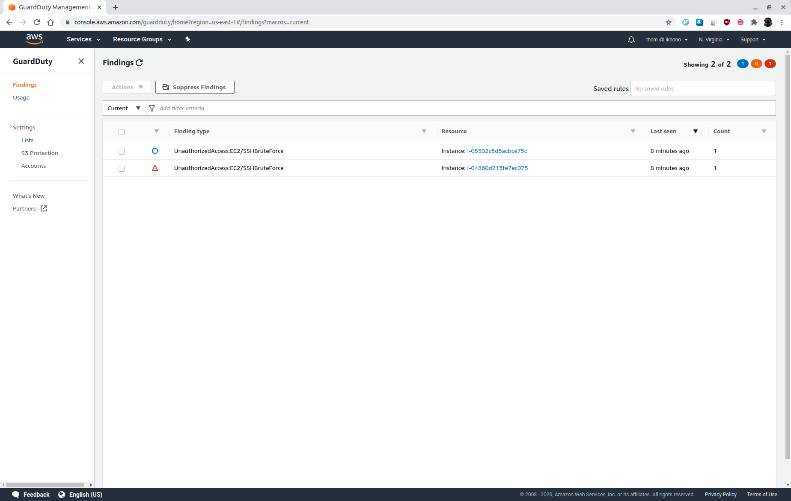 _Guard Duty findings specific to the attack_

##### Research the AWS Guard Duty documentation page and explain how GuardDuty may have detected this attack - i.e. what was its source of information?

Amazon GuardDuty offers threat detection that enables to continuously monitor
and protect AWS accounts, workloads, and data stored in Amazon S3.

GuardDuty analyzes continuous streams of meta-data generated from account and
network activity found in AWS CloudTrail Events, Amazon VPC Flow Logs, and DNS
Logs. It also uses integrated threat intelligence such as known malicious IP
addresses, anomaly detection, and machine learning to identify threats more
accurately.

In this case, GuardDuty detected the attack by scanning Amazon VPC Flow Logs for
login attempts on port 22 (SSH).

See [E3T1.txt](answers/E3T1.txt).

### Task 2: Accessing Secret Recipe Data File from S3

Imagine a scenario where API keys used by the application server to read data
from S3 were discovered and stolen by the brute force attack. This provides the
attack instance with the same API privileges as the application instance. 

Test this scenario by attempting to use the API to read data from the secrets S3
bucket.

#### 1. Run the following API calls to view and download files from the secret recipes S3 bucket

```
# view the files in the secret recipes bucket
aws s3 ls s3://<BucketNameRecipesSecret>/ --region us-east-1
 
# download the files
aws s3 cp s3://<BucketNameRecipesSecret>/secret_recipe.txt  .  --region us-east-1

# view contents of the file
cat secret_recipe.txt
```

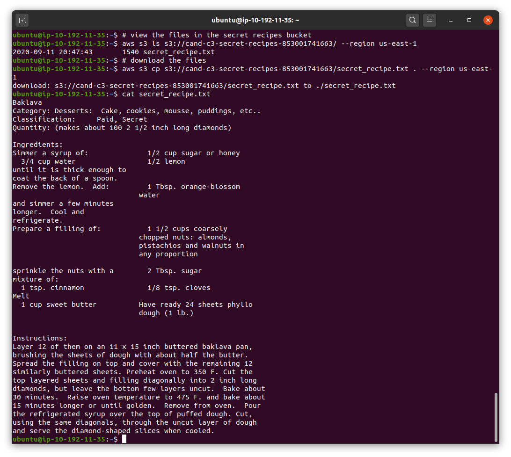 _Resulting breach after the brute force attack_

## Exercise 4 - Implement Security Hardening

### Task 1 - Remediation plan

As a Cloud Architect, you have been asked to apply security best practices to the environment so that it can withstand attacks and be more secure.

#### 1. Changes that can be made to the environment to prevent an SSH brute force attack from the internet
- Update the application server security group to only permit connections from
  the Application Load Balancer security group
- Disable SSH access by removing connections to port 22 from the application
  server security group
- Disable SSH password login on the application server instance

#### 2. Neither instance should have had access to the secret recipes bucket; in the instance that API credentials were compromised. how could access to sensitive data have been prevented?
- Enforce default encryption through S3 bucket policy
- Restrict access to only specific IAM roles, i.e. using a new role specifically
  for accessing the S3 bucket (least privilege access)

### Task 2 - Hardening

#### Remove SSH Vulnerability on the Application Instance

1. To disable SSH password login on the application server instance:

```
# open the file /etc/ssh/sshd_config
sudo vi /etc/ssh/sshd_config

# Find this line:
PasswordAuthentication yes

# Change it to:
PasswordAuthentication no

# Save and exit

# Restart SSH server
sudo service ssh restart
```

2. Run the brute force attack again from Exercise 3, Task 1.  

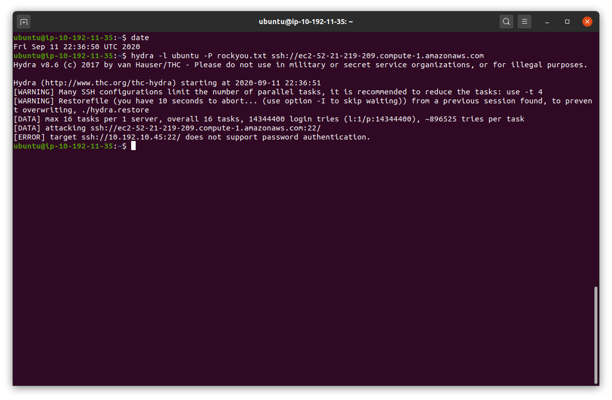 _Terminal window showing the brute force attack and the remediation_

#### Apply Network Controls to Restrict Application Server Traffic

Update the security group which is assigned to the web application instance. The
requirement is that it only allows connections to port 5000 from the public
subnet where the application load balancer resides.

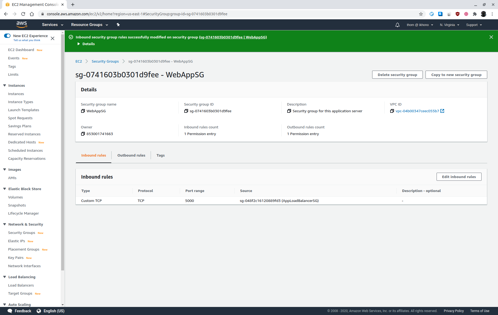 _Security group change_

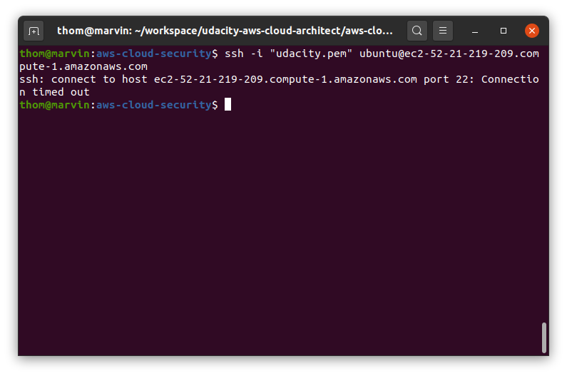

#### Least Privilege Access to S3  

Update the IAM policy for the instance profile role used by the web application
instance to only allow read access to the free recipes S3 bucket.

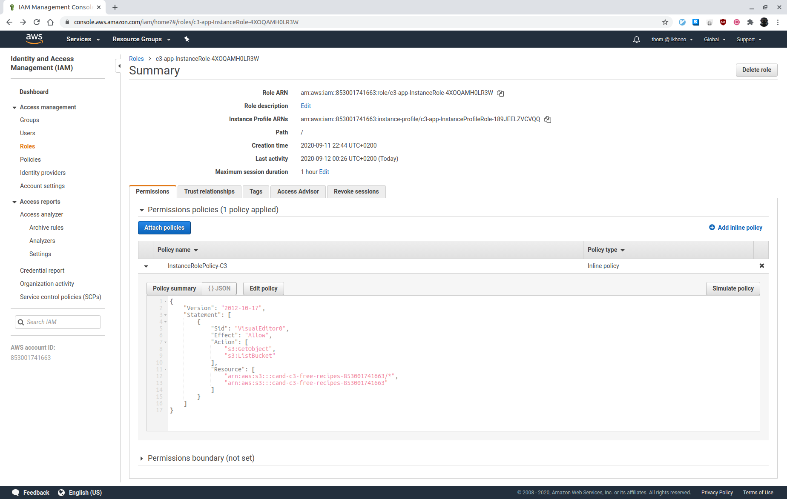 _Updated IAM policy_

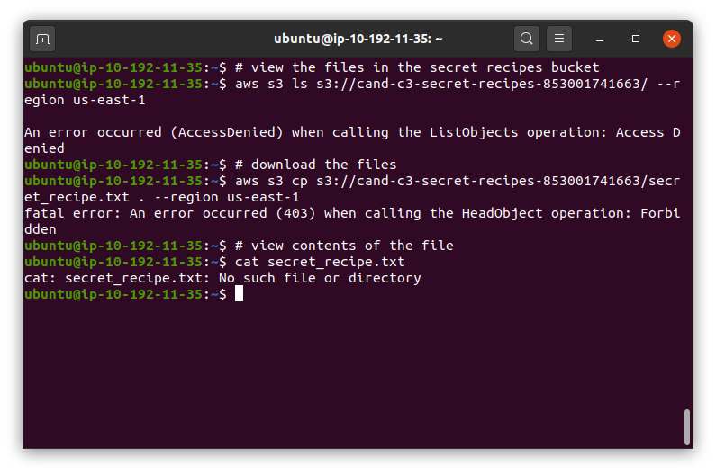 _Failed copy attempt_

#### Apply Default Server-side Encryption to the S3 Bucket

Configure the S3 service to encrypt any objects that are stored going forward by
default ([Amazon S3 Default Encryption for S3 Buckets](https://docs.aws.amazon.com/AmazonS3/latest/dev/bucket-encryption.html))

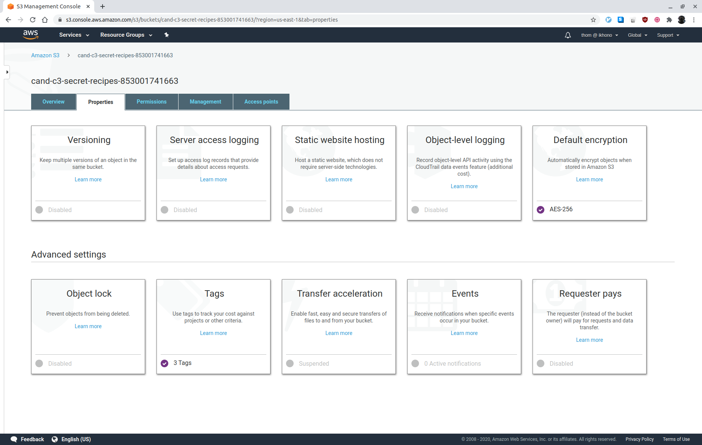 _S3 bucket policy_

### Task 3: Check Monitoring Tools to see if the changes that were made have Reduced the Number of Findings

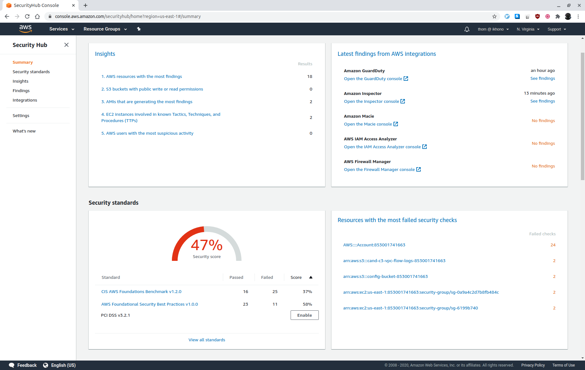 _Security Hub after reevaluating the number of findings_

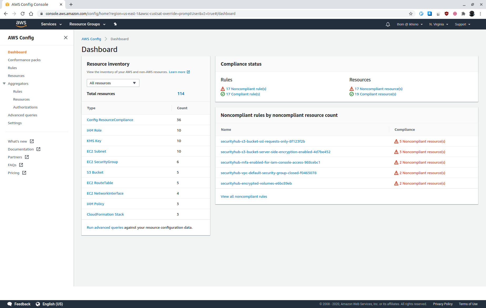 _Config after reevaluating the number of findings_

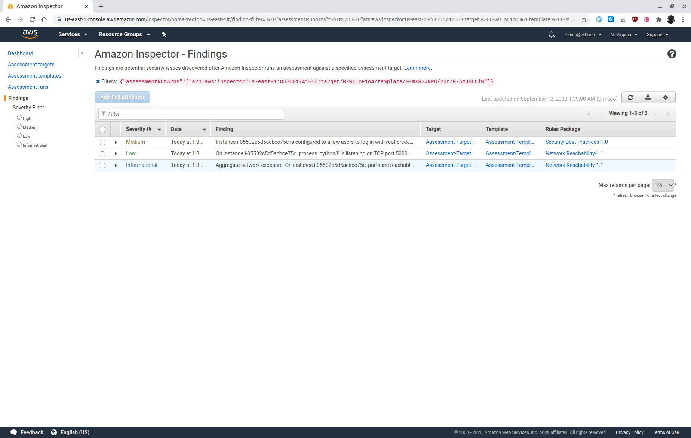 _Inspector after reevaluating the number of findings_

### Task 4: Questions and Analysis

#### 1. What additional architectural change can be made to reduce the internet-facing attack surface of the web application instance?
- Application Load Balancer should be configured to redirect all HTTP requests
  to HTTPS: Reconfigure the Application Load Balancer to redirect all HTTP
  requests to HTTPS
- Move the web application EC2 instance into a private subnet and use a NAT
  gateway

#### 2. Assuming the IAM permissions for the S3 bucket are still insecure, would creating VPC private endpoints for S3 prevent the unauthorized access to the secrets bucket?
- Only for users who are not authenticated on the same account
- Those users can still access the S3 bucket through the VPC private endpoints

#### 3. Will applying default encryption setting to the S3 buckets encrypt the data that already exists?
- No, applying default encryption setting to the S3 buckets does not encrypt the
  data that already exists
- It only applies to future uploads and existing objects must be re-uploaded

#### 4. The changes you made above were done through the console or CLI; describe the outcome if the original CloudFormation templates are applied to this environment?
- The changes made through the console or the CLI would be reset to the settings
  from the original CloudFormation templates

See [E4T4.txt](answers/E4T4.txt).

## Exercise 5 - Designing a DevSecOps Pipeline

 _DevOps pipeline_

The high-level steps are as follows:

1. The user makes a change to the application code or OS configuration for a
   service
2. Once the change is committed to the source, a build is kicked off resulting
   in an AMI or a container image
3. The infrastructure as code is updated with the new AMI or container image to
   use
4. Changes to cloud configuration or infrastructure as code may have also been
   committed
5. A deployment to the environment ensues applying the changes

### Task 1:  Design a DevSecOps pipeline

Add additional security steps to the DevOps pipeline:
- Infrastructure as code compliance scanning
- AMI or container image scanning
- Post-deployment compliance scanning

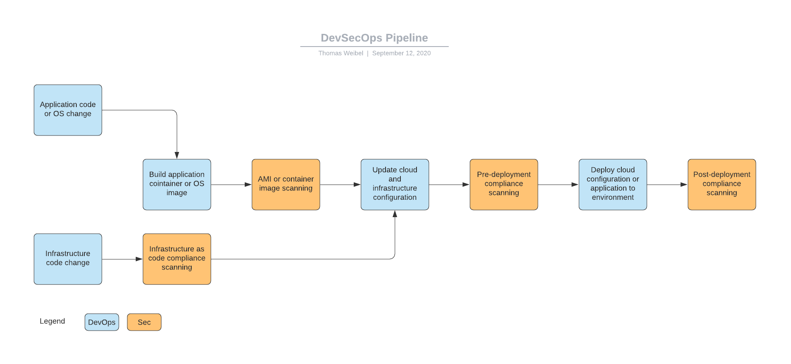 _DevSecOps pipeline_

### Task 2 - Tools and Documentation

Tools to incorporate into the pipeline to ensure that security vulnerabilities are found:

#### Scan infrastructure as code templates
- [Checkov](https://www.checkov.io/): Scans cloud infrastructure managed in
  Terraform, Cloudformation, Kubernetes, Arm templates or Serverless Framework
  and detects misconfigurations
- [TFLint](https://github.com/terraform-linters/tflint): Terraform linter
  focused on possible errors, best practices, etc.
- [Terrafirma](https://github.com/wayfair/terrafirma): Terraform static analysis
  tool designed for detecting security misconfigurations
- [Terrascan](https://www.accurics.com/products/terrascan/): Provides
  out-of-the-box policies so that you can scan IaC against common policy
  standards such as the CIS Benchmark
- [Cloudsploit](https://cloudsploit.com/cloudformation): Plugin-based scans, API
  access and web GUI
- [Cfripper](https://github.com/Skyscanner/cfripper): Library and CLI security
  analyzer for AWS CloudFormation templates

These tools help to detect misconfigurations such as too permissive security
groups, missing encryption settings, etc. before the infrastructure is deployed.

#### Scan AMI’s or containers for OS vulnerabilities
- [Anchore](https://anchore.com/): Inspects, analyzes, and certifies Docker
  images
- [Clair](https://github.com/quay/clair): Vulnerability scanner and static
  analysis tool for container images
- [Dagda](https://github.com/eliasgranderubio/dagda/): Performs static analysis
  of known vulnerabilities and uses the ClamAV anti-virus engine to scan and
  detect trojans, viruses, and malware contained within Docker images
- [OpenSCAP](https://www.open-scap.org/): Provides a set of tools for scanning
  and compliance management, including oscap-docker, which can scan a container
  image
- [Trivy](https://github.com/aquasecurity/trivy): Vulnerability scanner for
  containers and other artefacts

These tools scan containers for known vulnerabilities such as outdated operating
systems, applications and libraries, e.g.:
- Old operating systems known vulnerabilities
- Detecting trojans, viruses and malware

#### Scan an AWS environment for cloud configuration vulnerabilities
- [AWS GuardDuty](https://aws.amazon.com/guardduty/): Threat detection service
  that continuously monitors for malicious activity and unauthorized behavior to
  protect your AWS accounts, workloads, and data stored in Amazon S3
- [AWS Inspector](https://aws.amazon.com/inspector/): Automatically assesses applications for exposure,
  vulnerabilities, and deviations from best practices
- [AWS Security Hub](https://aws.amazon.com/security-hub/): Aggregates,
  organizes and prioritizes security alerts, or findings, from multiple AWS
  services, such as Amazon GuardDuty, Amazon Inspector, Amazon Macie, AWS
  Identity and Access Management (IAM) Access Analyzer, and AWS Firewall
  Manager, as well as from AWS Partner solutions
- [AWS Config](https://aws.amazon.com/config/): Enables assessing, auditing, and
  evaluating the configurations of AWS resources
- [AWS CloudTrail](https://aws.amazon.com/cloudtrail/): Log, continuously
  monitor, and retain account activity related to actions across AWS
  infrastructure
- [Cloud Custodian](https://github.com/cloud-custodian/cloud-custodian): Rules
  engine for managing public cloud accounts and resources
- [Prowler](https://github.com/toniblyx/prowler): AWS account security
  configuration assessment, auditing, and hardening tool

These tools allow to continuously monitor for malicious activity and
unauthorized behavior to protect your AWS accounts, workloads, and data stored
in AWS services, e.g.:
- Weak password rules
- Violations of least privilege
- Accounts without MFA

See [E5T2.txt](answers/E5T2.txt.txt).

### Task 3 - Scanning Infrastructure Code

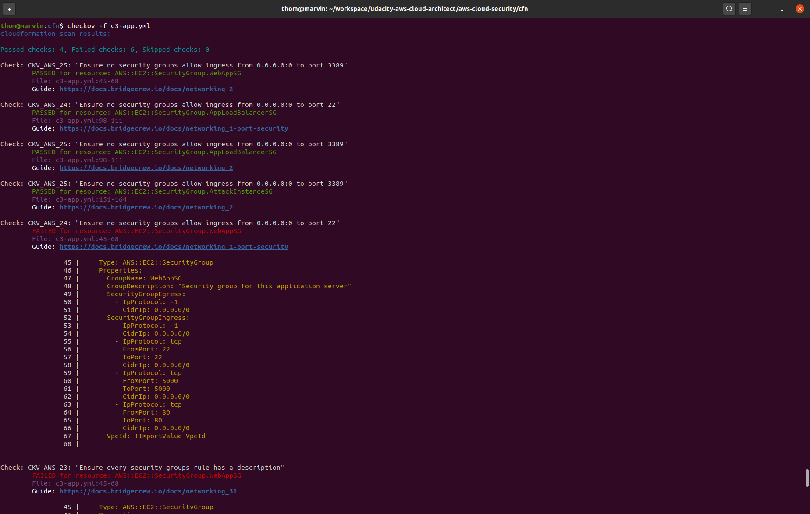 _Vulnerability scan with Checkov_

## Exercise 6 - Clean up

To prevent undesired charges don’t forget to: 
- Disable Security Hub and Guard Duty
- Delete recipe files uploaded to the S3 buckets
- Delete CloudFormation stacks

## Requirements

Graded according to the [Project Rubric](https://review.udacity.com/#!/rubrics/2800/view).

## License

- **[MIT license](http://opensource.org/licenses/mit-license.php)**
- Copyright 2020 © [Thomas Weibel](https://github.com/thom).